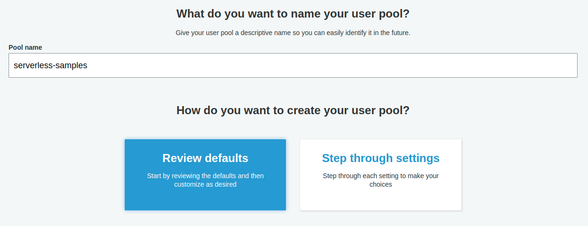
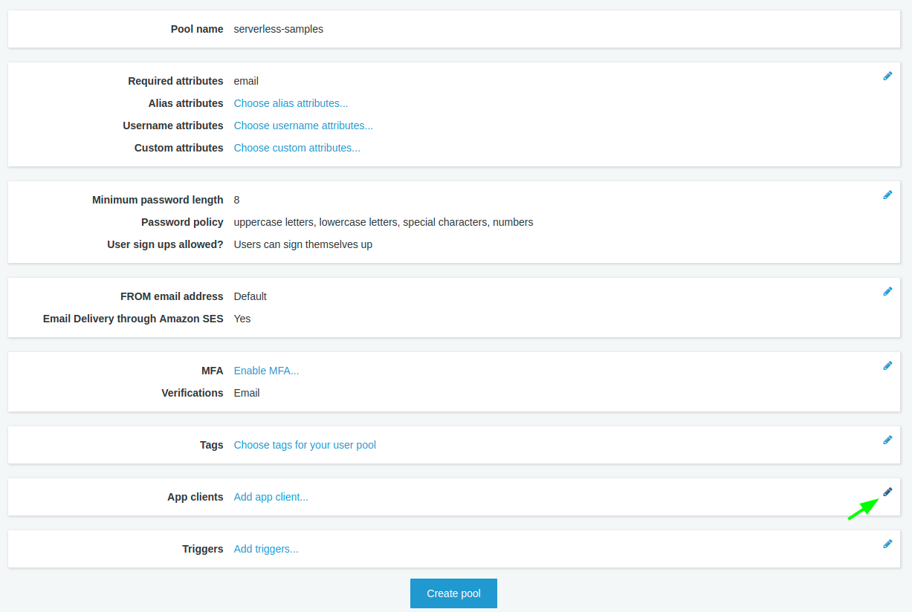
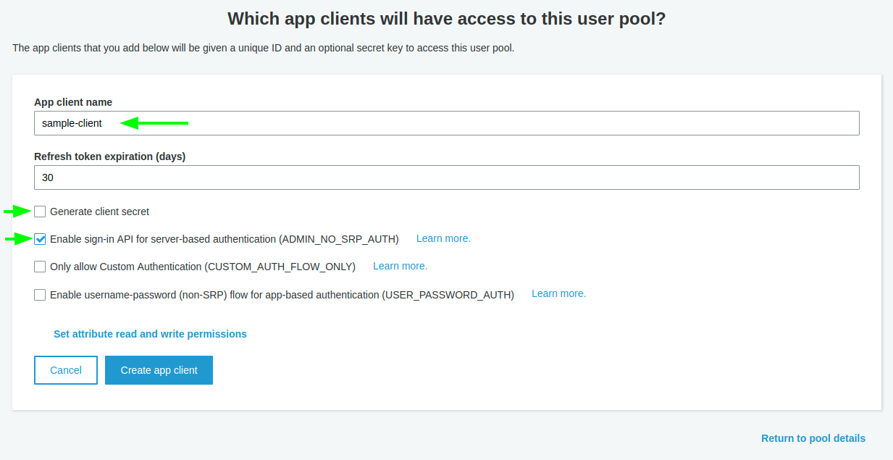

# Sample: REST Services with Cognito Authorizer

This sample serverless application is a basic example of how to implement a Cognito Authorizer for a REST API. In this sample, tokens are obtained from an AWS Cognito User Pool and the identity token is passed to an API Gateway endpoint to authorize access.

## How to Use

### Install Dependencies

Install the project dependencies with the Yarn package manager. Navigate to the application base directory and issue the following command:

```
yarn install
```

### Create Cognito User Pool

**Note:** This example assumes that you create a Cognito User Pool with the default configuration except where explicit instructions are provided below. Deviating from this configuration may cause the *CLI commands* in subsequent steps of this guide to fail.

Log into the AWS Console and go to the Cognito service. Select *User Pools* and click the button to *Create a user pool*.



Give your User Pool a name like *serverless-samples*. Since we want our User Pool to be configured with default values, select the *Review defaults* button. Cognito will display a summary of the User Pool configuration.



Click the *edit* icon, which looks like a pencil, in the *App clients* section of the summary page.



Add an App client to the pool. Enter a client name. Remove the check from *Generate client secret*. Check the box labelled *Enable sign-in API for server-based authentication (ADMIN_NO_SRP_AUTH)*. Click the *Create app client* button to add this application client to your User Pool. Note the *App client id* for later use. Finally, click the *Return to pool details* button to return to the summary page.

Click the *Create pool* button and Cognito creates your User Pool, displaying the *General Settings* page. On this page, you can find your *Pool Id* and *Pool ARN* which you will need for your serverless.yml and CLI commands.

### Cognito CLI Commands

To interact with the REST API provisioned by this sample project, you will need to *sign up*, i.e. register, a user in your Cognito User Pool, *confirm* the sign up, and, finally, *authenticate* the user to receive tokens to call the API.

#### Sign Up

Execute the following command at a terminal prompt to create a user in the Cognito User Pool replacing the placeholders in {curly braces} with your values.

```
aws cognito-idp sign-up \
  --client-id {clientId} \
  --username {username} \
  --password {password} \
  --user-attributes Name={attributeName},Value={attributeValue},Name={anotherAttributeName},Value={anotherAttributeValue}

Example:

aws cognito-idp sign-up \
  --client-id 61nk374gr2a81apsa3odamniso \
  --username joeuser \
  --password 1greaTp@ss \
  --user-attributes Name=email,Value=joe@example.com
```

OR... when using email as the username and to include user attributes...

```
aws cognito-idp sign-up \
  --client-id {clientId} \
  --username {emailAddress} \
  --password {password} \
  --user-attributes Name={attributeName},Value={attributeValue},Name={anotherAttributeName},Value={anotherAttributeValue}
```

#### Admin Confirm Sign Up

Newly registered users are in pending status and cannot be issued tokens. Execute the following command at a terminal prompt to confirm user sign up.

```
aws cognito-idp admin-confirm-sign-up \
  --user-pool-id {poolId} \
  --username {username}

Example:

aws cognito-idp admin-confirm-sign-up \
  --user-pool-id us-east-1_07ksBD9fu \
  --username joeuser
```

#### Admin Initiate Auth

Create a file named `auth.json` with the following content:

```
{
    "UserPoolId": "{poolId}",
    "ClientId": "{clientId}",
    "AuthFlow": "ADMIN_NO_SRP_AUTH",
    "AuthParameters": {
        "USERNAME": "{username}",
        "PASSWORD": "{password}"
    }
}

Example:

{
    "UserPoolId": "us-east-1_07ksBD9fu",
    "ClientId": "61nk374gr2a81apsa3odamniso",
    "AuthFlow": "ADMIN_NO_SRP_AUTH",
    "AuthParameters": {
        "USERNAME": "joeuser",
        "PASSWORD": "1greaTp@ss"
    }
}
```

Then, issue the following command to obtain identity and access tokens from Cognito.

```
aws cognito-idp admin-initiate-auth --cli-input-json file://auth.json
```

### Run the Application

Update the serverless.yml file, placing your User Pool ARN in the `arn` attribute of the `hello` function. Run the serverless application. Navigate to the application base directory and issue the following command:

```
sls deploy
```

The Serverless Framework packages and deploys the application to AWS. The framework writes information about the deployed application to the console. Be sure to note the endpoint URL(s) to use in testing.

To test the deployed application, you may use cURL, or better yet, a REST client such as Postman. Create a request for the `/hello` endpoint and include the `Authorization` header containing the `IdToken` from the CLI authentication response. 

### Remove the Application

To remove the serverless application from AWS, navigate to the application base directory and issue the following command:

```
sls remove
```

### Remove Cognito User Pool

From the AWS Console, navigate to the Cognito service. Select *User Pools* to view a list of your provisioned Cognito User Pools.

Click the User Pool to remove. Click the *Delete pool* button and confirm.

**Note:** Every time you create a new User Pool, you will need to update your `serverless.yml` and `auth.json` files with new ARNs and IDs.

## See Also

[Strategies for implementing user authentication in serverless applications][sls-authn]  
[Configure HTTP Endpoints with Authorizers](https://serverless.com/framework/docs/providers/aws/events/apigateway#http-endpoints-with-custom-authorizers "API Gateway Events with Authorizers | Serverless Docs")  
[Use Cognito User Pool as Authorizer for a REST API](https://docs.aws.amazon.com/apigateway/latest/developerguide/apigateway-integrate-with-cognito.html "Use Cognito User Pool as Authorizer for a REST API | AWS Docs")  

[sls-authn]: https://serverless.com/blog/strategies-implementing-user-authentication-serverless-applications/ "AuthN Strategies | Serverless Blog"
